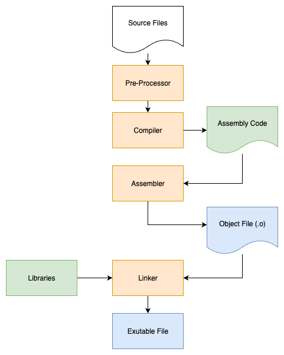
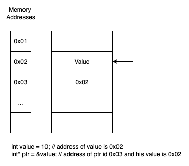

<samp>

Advanced C Programming Notes
---
> Intermediate to advanced notes for C programming.
> Collected from courses and books to brush up my C know-how. 
> The topics noted is a personal choice.

## Index
- [Part One - The language](#part-one---the-language)
  - [Standards Overview](#standards-overview)
    - [1. K&R C (1978)](#1-kr-c-1978)
    - [2. ANSI C / C89 / C90 (1989/1990)](#2-ansi-c--c89--c90-19891990)
    - [3. C95 (ISO/IEC 9899:1995)](#3-c95-isoiec-98991995)
    - [4. C99 (ISO/IEC 9899:1999)](#4-c99-isoiec-98991999)
    - [5. C11 (ISO/IEC 9899:2011)](#5-c11-isoiec-98992011)
    - [6. C17 (ISO/IEC 9899:2018)](#6-c17-isoiec-98992018)
    - [7. C23 (ISO/IEC 9899:2023)](#7-c23-isoiec-98992023)
  - [Modules and Variables](#modules-and-variables)
    - [Storage classes Overview](#storage-classes-overview)
  - [Advanced Data Types](#advanced-data-types)
  - [Type Qualifiers](#type-qualifiers)
  - [Bit Manipulation](#bit-manipulation)
    - [Masking](#masking)
    - [Bit fields](#bit-fields)
  - [Advanced Control Flow](#advanced-control-flow)
  - [Working with files](#working-with-files)
  - [Advanced Function Concepts](#advanced-function-concepts)
    - [Variadic Functions](#variadic-functions)
    - [Inline Functions](#inline-functions)
    - [_Noreturn Function Specifier](#noreturn-function-specifier)
  - [Unions](#unions)
    - [Type punning](#type-punning)
  - [Macros](#macros)
    - [Variadic Macros](#variadic-macros)
    - [View expanded result](#view-expanded-result)
    - [Preprocessor operators](#preprocessor-operators)
    - [Some predefined Macros](#some-predefined-macros)
  - [Advanced Debugging and Compiler options](#advanced-debugging-and-compiler-options)
    - [Linking](#linking)
    - [GDB Basic](#gdb-basic)
    - [Core Dump](#core-dump)
    - [Analysis with external tools](#analysis-with-external-tools)
  - [Advanced Pointers](#advanced-pointers)
    - [Dynamic memory allocation](#dynamic-memory-allocation)
    - [Function pointers](#function-pointers)
    - [Void pointers](#void-pointers)
- [Part Two - Programming Concepts](#part-two---programming-concepts)
  - [Interprocess Communication](#interprocess-communication)
  - [Threads](#threads)

## Part One - The language
*The syntax, built-in functions and the compiler*
### Standards Overview

The C programming language has evolved through several standards, each introducing new features, improvements, and clarifications. Here’s a chronological summary of the main C standards, with brief descriptions and usage recommendations:

#### 1. K&R C (1978)
- The original version described by Brian Kernighan and Dennis Ritchie in "The C Programming Language" book.
- Historical interest only. Not recommended for modern development.

#### 2. ANSI C / C89 / C90 (1989/1990)
- The first standardized version by ANSI (American National Standards Institute) in 1989, later adopted as ISO C90. Introduced function prototypes, standard library, and improved portability.
- Still found in legacy codebases. Use only if targeting very old systems or compilers.

#### 3. C95 (ISO/IEC 9899:1995)
- A minor revision of C90, mainly for bug fixes and clarifications. Added some library functions like `wchar_t` support.
- Rarely targeted directly; mostly a transitional standard.

#### 4. C99 (ISO/IEC 9899:1999)
- Major update introducing features like `inline` functions, variable-length arrays, new data types (`long long`, `stdint.h`), single-line comments (`//`), and improved support for floating-point arithmetic.
- Widely supported and recommended for modern codebases that need these features. Good balance of portability and modern features.

#### 5. C11 (ISO/IEC 9899:2011)
- Added multi-threading support (`<threads.h>`), improved Unicode support, anonymous structures/unions, and safer library functions (e.g., `gets()` removed).
-  Recommended for new projects if your toolchain supports it. Brings safer and more robust programming features.

#### 6. C17 (ISO/IEC 9899:2018)
- Bug-fix and clarifications release over C11. No major new features.
- Use as a drop-in replacement for C11 if available.

#### 7. C23 (ISO/IEC 9899:2023)
- The latest standard, with further improvements, new library functions, and language enhancements. Adoption is ongoing.
- Use if you need the latest features and your compiler supports it.

---

**Recommendations:**
- For maximum portability, use **C89/C90** features only.
- For modern development, **C99** or **C11** are recommended (C11 preferred for new projects).
- Use **C17** or **C23** if you need the latest features and your toolchain supports them.
- Always check your compiler’s support for the chosen standard.

> **Tip:** You can specify the C standard in your build system or compiler (e.g., `-std=c11` for GCC/Clang).

### Modules and Variables
. Generally, a C file (.h and .c files) is a module.

. In a module (in a file) I can declare a local variable or a global variable. 
- Local variables can be used inside the function where they are defined. They are allocated on the stack or on the heap if malloc is used explicitly, see a example [here](./_stack_heap_alloc/main.c)
- Global variables can be used in any other module (declaring them as extern. [Example](./_files_communication/src/))
- If a global variable is declared with `static` it's valid only in the same module.
```C
int number_from_function = 42;  // Global variable
static int private_var = 88;    // It's global for the current module

// Can be called from outise function.c using extern
int foo() { 
    return 50;
}

// Cannot be called from outside function.c
static int bar() {
    return 51;
}
```
. `Register` keyword is used in a variable declaration (any type of data) when that variable should be stored in a register instad of RAM. When a variable is used heavily.
```C
int main(int argc, char** argv) {
    // Declare a variable directly in a CPU register
    register int regVariable = 1; // Has local liftime
    // You cannot obtain the address of a register variable of course.
    // int* reg_ptr = &regVariable; // Compile-time error
}
```
#### Storage classes Overview
| Storage Class | Declaration Location | Scope | Lifetime | 
| --- | --- | --- | --- |
| `auto` | Inside a function block | Within the function/block | Until the function block completes |
| `register` | Inside a function block  | Within the function/block | Until the function block completes |
| `extern` | Outside all functions  | Entire file where declared as extern | Until the program terminates |
| `static` local | Inside a function block  | Within the function/block | Until the program terminates |
| `static` global | Outside all functions  | Entire file in which it's declared | Until the program terminates |

An example, [here](./_storage_classes/main.c)
### Advanced Data Types
. `#define` preprocessor directive can be used to define symbolic, or manifest, constants in a program. Is limited to one line length (but backslash/newline can be used to spread on multiple physical lines). Executed before the compilation. It's literally a substitution before compilation.

. Primary use of the `#define` preprocessor is to assign a symbolic name: `#define YES 1` or `#define PI 3.14`

. `typedef` keyword enables to create an own name for an existing data type: `typedef in Counter` define a counter variable of type `int`.
```C
typedef char* char_ptr;
char_ptr p;     // char* p;
char_ptr a, *b  // char *a, **b;
```
. In general, `typedef` is useful to keep the programs simple and easy to work with and improve code portability. As example, when working on size: The size of int may vary across platforms. `typedef` can be used to abstract the underlying type:
```C
// types.h
#ifndef _SIZE_T
#define _SIZE_T
#include <machine/_types.h> /* __darwin_size_t */
typedef __darwin_size_t        size_t;
#endif  /* _SIZE_T */
```
```C
// main.c
size_t size;
```
. On the current machine, a Mac, `size_t` is a defined type exactly as showed: `typedef __darwin_size_t        size_t;` in system headers. This is a real example of `typedef` feature usage for portability.

> About array's length: Variable length array should be avoided. Use pointers and `malloc` and `realloc` instead.

. Flexible array members (FAMs) in C are a feature for defining structs with a variable-sized array at the end, typically used in low-level systems programming, memory management, or serialization.
```C
#include <stdio.h>
#include <stdlib.h>
#include <string.h>

struct pkt {
    size_t length;
    char data[];    // Flexible array member declared as the latest item of the struct with [].
};

int main(void) {

    printf("Flexible array members are supported from C99 standard. This program is compiled using: %ld\n", __STDC_VERSION__); 

    const char* msg = "Welcome message!";
    size_t msg_length = strlen(msg) + 1;
    struct pkt* packet_ptr = malloc(sizeof(struct pkt) + msg_length);

    packet_ptr->length = msg_length;
    memcpy(packet_ptr->data, msg, msg_length);

    printf("Payload: %s\n", packet_ptr->data);

    return 0;
}
```
. Designed initializers help to declare an array of elements with predefined value. Is pretty simple: `struct point {int x, y;};`. `struct point pts[5] = { [2].y = 5,  [2].x = 6}`. Initialize only the third element of the array.

. `unsigned` can be used with char, short, int, and long. If you assign a negative value to an unsigned variable, it wraps around (underflows). Useful for bitwise operations, counting, and when negative values are not needed.
### Type Qualifiers
. The `const` keyword is widely used in applications. Not only for constant value delcarations.
- `const float *pf;` Is a pointer to constant float value. The value cannot change.
- `float * const pt;` Is a constant pointer to a float variable. The pointer cannot change but the value can.
- `const float * const ptr;` Both are constants.
- `float const *pfc;` The same of `const float *pfc` but the pointer cannot be used to change the value.

. On parameters
- Here `void display(const int array[], int limit)` the first parameter is an array of constant elements, these cannot be changed.
- As the following: `char *strcat(char *restrict s1,  const char * restrict s2);` The second parameter is not going to change.

. Another typical usage of `const` is in the global variables. To ensure to create a single constant copy of a variable: `static const char A = 'A';`.

. `volatile` is particularly used in embedded software for memory-mapped peripheral registers or global variables accessed by multiple tasks within a multi-threaded application. He force the compiler to not optimise a variable usage and to not use any caching with it but to obtain the most updated value of it. A variable should be declared as volatile whenever its value could change unexpectedly. Probably will be much more clear in the multi-threaded related chapter.

. A pointer can be `volatile`, and there are different ways to declare a volatile pointer depending on what exactly needs to be volatile.

. Volatile Pointer to Non-Volatile Data
```c
int data = 42;
int *volatile ptr = &data;  // The pointer itself is volatile
```
Here, the pointer's address can change unexpectedly, but the data it points to is normal.

. Non-Volatile Pointer to Volatile Data
```c
volatile int status_register;
volatile int *ptr = &status_register;  // Points to volatile data
```
Here, the data being pointed to can change unexpectedly, but the pointer itself is normal.

. Volatile Pointer to Volatile Data
```c
volatile int status_register;
volatile int *volatile ptr = &status_register;  // Both pointer and data are volatile
```
Both the pointer's address and the data it points to can change unexpectedly.

. Here's a practical example showing these concepts:
````c
#include <stdio.h>

void hardware_monitor(void) {
    // Memory-mapped hardware register (volatile data)
    volatile int *status = (volatile int *)0x20000000;
    
    // Pointer that can be modified by an interrupt routine
    int *volatile interrupt_ptr;
    
    // Both pointer and data can change unexpectedly
    volatile int *volatile dual_volatile_ptr;
    
    // Reading from volatile memory
    int value = *status;  // Will always read from memory, not cached
}
````
. The key rule is: use `volatile` when the value (either the pointer or what it points to) can change in ways the compiler can't predict through normal program flow.

. A parameter can be both `const` and `volatile`. This combination is particularly useful when dealing with hardware registers that shouldn't be modified by the software but can change due to hardware events.
```c
#include <stdio.h>

// Function that reads from a hardware status register
void check_status(volatile const int* status_register) {
    // Can read but not modify the register
    // Will always read from memory due to volatile
    // Will not cache the value due to volatile
    if (*status_register & 0x1) {
        printf("Status bit 0 is set\n");
    }
}

int main(void) {
    // ...existing code...

    // Example with both const and volatile
    volatile const int hardware_status = 0x1;  // Simulating a read-only hardware register
    check_status(&hardware_status);

    return 0;
}
```
. `restrict` is a another optimization oriented keyword, introduced by the C99 standard, that can be used in pointer declarations. By adding this type qualifier, a programmer hints to the compiler that for the lifetime of the pointer, no other pointer will be used to access the object to which it points. Without the restrict, the compiler has to assume the worse case that some other identifier might have changed the data in between two uses of a pointer. it's a promise from the programmer to the compiler. Breaking this promise leads to undefined behavior

. The following would be incorrect usage:
```c
void vector_add(double * restrict result, 
            const double * restrict v1, 
            const double * restrict v2, 
            int size);

double arr[] = {1.0, 2.0, 3.0, 4.0};
vector_add(arr, arr, arr, 4);  // Wrong! Pointers overlap
```
. All these features still rely on the developer responsability but produce effective more optimized code when used correctly!

. Let's see a comprensive example [here](./_t_qualifiers/main.c).
### Bit Manipulation
. Bit manipulation techniques can be used to solve various conversion problems, often leading to more efficient solutions compared to traditional arithmetic methods. Classical conversion problems leveraging bit manipulation [example](./_common/bin_2_short.c).

. Bit operations can be performed on any type of integer value and characters, but cannot be performed on floating-poit values.

. Bitwise operations with a mask are usually used to store multiple information in a variable (each bit corresponds to a setting).

| Operation | Operator | Example |
| --- | --- | --- |
| Setting Bits | `\|` (OR) | `value \| mask` |  
| Clearing Bits | `&` (AND) | `value & (~mask)` |
| Toggling Bits | `^` (XOR) | `value ^ mask` |
| Shifting left (multiply by 2^n) | `<<` | `value << n` | 
| Shifting right (divide by 2^n) | `>>` | `value >> n` | 
#### Masking
. A mask can be used to set multiple bits in a byte to either on, off or inverted from on to off using a single bitwise operator.

. Let's see a command-line utility example [here](./_masking/main.c) (set/unset bit into a flag variable).

| Pattern | Code Example | Description |
| --- | --- | --- |
| Single Bit Set | `value \| (1 << bit_position)` | Set bit at specific position |
| Single Bit Clear | `value & ~(1 << bit_position)` | Clear bit at specific position |
| Single Bit Toggle | `value ^ (1 << bit_position)` | Toggle bit ar specific position |
| Single Bit Test | `(value & (1 << bit_position)) != 0` | Test if bit is test |
| Multiple Bits Extract | `(value & mask) >> shift` | Extract and right-align bits |
| Bit Field Set | `(value & ~mask) \| (new_value << shift)` | Set multiple bits to new value |
- Very often, all these possibilities of bit manipulations are used to pack data very efficiently.
#### Bit fields
A bit field is an insightful way to store data in a very efficient way. Can be used and declared as follows:
```c
struct packed_str {
    unsigned int :3         // Padding, 3 bits
    unsigned int f1:1       // Flag 1, one bit
    unsigned int f2:1       // Flag 2, one bit
    unsigned int f3:1       // Flag 3, one bit
    unsigned int type:8     // Type field, 8 bits
    unsigned int index: 18  // index field, 18 bits
};

void main(void) {
    struct packed_str data;
    data.type = 7;
}
```
A bit field allow you to specify the number of bits in which an int member of a structure is stored. Is more easy then use a bit masking etc.
### Advanced Control Flow
. The `goto` instruction should not be used in C because it leads to logic that is too complex to interpret and makes the software difficult to maintain. However, there is one case where it can be useful to use it. When we need to exit from several levels of nested loops, the instruction saves us from creating additional interrupt logic at each level.

. The null statement `;` does nothing, just a syntax utility when do nothing is needed! :)
```c
while (condition)
    ; // do nothing, just wait for condition to become false
```
. The comma operator `,` is a unique binary operator that acts as sequence point and has some special characteristics that make it useful in specific scenarios like for expression: `for(i=0, j=100; i!=10; j-=10)`.
- In Macros:
```c
#define DEBUG_PRINT(x) (printf("Debug: %s\n", #x), (x))
#define SWAP(a, b) ((a) ^= (b), (b) ^= (a), (a) ^= (b))

int result = DEBUG_PRINT(42);  // Prints "Debug: 42" and assigns 42 to result
```
- It has a lower precedence, so:
```c
int i = 249, 500;   // 249 is assigned
int j = (249, 500)  // 500 is assigned 
```
- Array initialization tricks:
```c
int arr[5];
int size = 5;
for (int i = 0; i < size; arr[i] = i * i, i++);  // Fill with squares
```
- Array initialization tricks:
```c
int arr[5];
int size = 5;
for (int i = 0; i < size; arr[i] = i * i, i++);  // Fill with squares
```
- Return multiple values:
```c
int calculate(int *sum, int *product, int a, int b) {
    return (*sum = a + b, *product = a * b, 1);  // Return success flag
}
```
- State Machines
```c
enum state { IDLE, PROCESSING, DONE };
enum state current_state = IDLE;
int data = 0;

// State transition with side effects
int next_state = (current_state == IDLE) ? 
    (printf("Starting processing\n"), data = get_data(), PROCESSING) :
    (current_state == PROCESSING) ? 
    (printf("Processing complete\n"), save_data(data), DONE) :
    (printf("Resetting\n"), data = 0, IDLE);
```
. `setjmp` and `longjmp` are legacy instructions, they allow you to save the current execution context (setjmp) and jump back to it later (longjmp), skipping normal function call/return flow. They are considered dangerous and hard to maintain because they break normal control flow and can cause resource leaks (e.g., skipping destructors, not freeing memory).
### Working with files
Just some raccomandations when working with files streams,
- Use fopen()/fclose() for file management.
- Use fgets()/fputs() for text files.
- Use fread()/fwrite() for binary files.
- Always check the return value of these functions for errors.
```c
#include <stdio.h>

int main(void) {
    FILE *fp = fopen("example.txt", "w");  // Open for writing
    if (!fp) {
        perror("Failed to open file for writing");
        return 1;
    }
    fputs("Hello, file!\n", fp);           // Write a string
    fclose(fp);                            // Close after writing

    fp = fopen("example.txt", "r");        // Open for reading
    if (!fp) {
        perror("Failed to open file for reading");
        return 1;
    }
    char buffer[100];
    while (fgets(buffer, sizeof(buffer), fp)) { // Read line by line
        printf("Read: %s", buffer);
    }
    fclose(fp);                            // Close after reading
    return 0;
}
```
### Advanced Function Concepts
#### Variadic Functions
A variadic function in C is a function that can accept a variable number of arguments. The most common example is printf(). To create a variadic function, you use the macros defined in `<stdarg.h>`: `va_list`, `va_start`, `va_arg`, `and va_end`. So, to define a variadic function:
```C
int sum(int count, ...) { // Accept a variable number of arguments of type int
    int total = 0;
    va_list args;
    va_start(args, count); // Initialize args to store all values after count

    for (int i = 0; i < count; i++) {
        total += va_arg(args, int); // Access next int argument
    }

    va_end(args); // Clean up
    return total;
}
```
`va_start()` uses the address of the last fixed parameter (count) to find the start of the variable arguments that follow.
#### Inline Functions
Added from C99, inline function avoid the amount of overhead that comes along with invoking a function. The point it to hint the compiler that it worth making some form of extra effort to call the function faster than it would otherwise. Usually by substituite the code of the function into its caller (eliminating the call), the code of the function is just placed into the caller every time that function is used. So, no call at all. 
But in-lining not guaranteed that code will run faster, it depends purely on your code design and is debatable.
```c
inline void randomFunction();
```
The inline function has to be in the same file as the function call (internal linkage). Should always use the inline function specifier along with the static storage-class spcecifier.
#### _Noreturn Function Specifier
The `_Noreturn` function specifier, introduced in the C11 standard, is used to indicate that a function does **not return to the caller**. This helps the compiler with optimization and static analysis (such as warning about unreachable code).
. Place `_Noreturn` before the function declaration or definition.
. Typically used for functions that terminate the program (e.g., by calling `exit()`, `abort()`, or entering an infinite loop).
```c
#include <stdio.h>
#include <stdlib.h>
#include <stdnoreturn.h> // Required for _Noreturn

_Noreturn void fatal_error(const char *msg) {
    fprintf(stderr, "Fatal error: %s\n", msg);
    exit(1); // Never returns
}

int main(void) {
    fatal_error("Something went wrong!");
    // Code here is unreachable
}
```
### Unions
Unions are particularly useful in embedding programming, situations where direct access to the hardware is needed. Unlike structs, unions store all the values at the same memory position (so, memory is shared along the members) and only one member can be accessed at a time. So, the size of a union is equal to the size of the largest member.
```c
union Data {
    int i;
    float f;
    char str[16]; // Largest member
} data;

int main()
{
    printf("The size of the Data union is: %d\n", sizeof(data));
    return 0;
}
```
The program output "The size of the Data union is: 16".
#### Type punning
Type punning is a technique in C where you access the same memory location using different types, allowing you to reinterpret the underlying bit pattern. It’s commonly used to inspect or manipulate the binary representation of data (e.g., viewing a float as a uint32_t). An example [here](./_type_punning/main.c).
### Macros
Essentially, a macro is a piece of code based on the `#define` directive. They are a text processing feature and are "expanded" and replaced by macro definitions. They are considered outdated in terms of modern programming practices however, macros are still widely used because they make things easier for the programmer.
Macros are similar to functions, but there are some huge differenices under the hood. Macros are pre-processed which means that all the macros would be processed before your program compiles. Due to theirs inline nature, macros are faster if used in loops, calling many times they could speed up the execution. Keeps in consideration also the facts that it is much harder to debug a macro than when you use a function.
```c
#include <stdio.h>

#define MY_SUM(a, b) a + b

int main() {
    printf("2 + 1 = %d\n", MY_SUM(2, 1));
}
```
Is equivalent to:
```c
#include <stdio.h>

inline static int sum(int a, int b) {
    return a + b;
}

int main() {
    printf("2 + 1 = %d\n", sum(2, 1));
}
```
Inline functions are the best alternative to macros.

Macros should use parentheses around each argument and around he definition as a whole that ensures the enclosed terms are grouped properly in an expression (avoid operator precedence).
```c
#define SQUARE(x) ((x) * (x))  // Correct: parentheses around argument and whole definition

int main() {
    int a = 5;
    int b = 2;
    int result = SQUARE(a + b); // Expands to ((a + b) * (a + b)) = 49
    printf("Result: %d\n", result); // Output: Result: 49
}
```
#### Variadic Macros
```c
#include <stdio.h>

#define Warning(format, ...) fprintf(stderr, format, __VA_ARGS__)

int main() {
    Warning("%s: This program is here\n", "Sandhaka");
    return 0;
}
```
#### View expanded result
So, since macro are essentially text substitutions, when debugging code with macros can be useful to view directly these substitutions.
On any Unix-like system, use the gcc or clang compiler with the -E option:
```sh
gcc -E main.c
```
or
```sh
clang -E your_file.c > expanded.c
```
This command runs the preprocessor only, outputting the source code with all macros expanded and includes processed.
```c
#define SQUARE(x) ((x) * (x))

int main() {
    int result = SQUARE(2 + 3);
    return result;
}
```
Will output:
```txt
# 1 "main.c"
# 1 "<built-in>" 1
# 1 "<built-in>" 3
# 465 "<built-in>" 3
# 1 "<command line>" 1
# 1 "<built-in>" 2
# 1 "main.c" 2


int main() {
    int result = ((2 + 3) * (2 + 3));
    return result;
}
```
#### Preprocessor operators
. The continuation operator `/`, is used to continue a macro that is too long for a single line.

. The defined operator `defined()`, is used in constant expression to determine if an identifier is defined using `#define`. It can also be used in #if statements.
```c
#if defined (DEBUG)
...
#endif
```
 . The `#`, `##` operators are often useful to merge two tokens into one while expanding macros. The usage of these operators will appear more clear with an example. 
 - The `#` operator is called the stringizing operator. When used in a macro definition, it converts the macro argument into a string literal.
```c
#include <stdio.h>

#define str(x) # x

int main(void) {
    printf(str(Progamming with MaCrOs!!));
}
```
`printf(str(Progamming with MaCrOs!!))` Is equivalent to: `printf("Progamming with MaCrOs!!")`. 
- The `##` operator is called token-pasting operator (or concatenation operator). It joins two tokens together during macro expansion to form a single token.
```c
#define TOKENCONCAT(x, y) x##y // Is replaced by OK in the program
```
```c
#define make_function(name) int my_##name(int foo) {}
make_function(bar)
// Will define a function called my_bar()
```
Don't you think it's pretty ugly? :)
Just look a more complex example.
#### Some predefined Macros
- `__FILE__`  
  Expands to a string literal containing the name of the current source file. Useful for logging and debugging to indicate where a message originated.

- `__LINE__`  
  Expands to the current line number (as an integer constant) in the source file. Often used with `__FILE__` for error reporting.

- `__func__`  
  Expands to a string literal containing the name of the current function. Standardized in C99. Useful for debugging and logging function entry/exit.

- `__DATE__`  
  Expands to a string literal representing the date the source file was compiled (e.g., "Aug  9 2025").

- `__TIME__`  
  Expands to a string literal representing the time the source file was compiled (e.g., "14:23:05").

- `__STDC__`  
  Defined as `1` when the compiler complies with the ANSI C standard (ISO C). Can be used to check for standard compliance in conditional compilation.

**Example usage:**
```c
printf("File: %s, Line: %d, Function: %s\n", __FILE__, __LINE__, __func__);
printf("Compiled on %s at %s\n", __DATE__, __TIME__);
#ifdef __STDC__
    printf("Standard C compiler detected.\n");
#endif
```
Very useful for print useful log or error messages!
### Advanced Debugging and Compiler options
The compilation process of a C program normally consists in four phases: Preprocessing, Compilation, Assembly and Linking. But there are specific options that can you pass to the compiler that will help with the process of debugging, optimization and other anhancements.
<p align="center">
  
</p>

- Pre-Processing
Expands macros, includes headers, and processes preprocessor directives.
```sh
gcc -E main.c -o main.i
```
- Compilation 
Converts preprocessed code to assembly language.
```sh
gcc -S main.i -o main.s
```
- Assembly
Converts assembly code to machine code (object file).
```c
gcc -c main.s -o main.o
```
- Linking
Links the object files and libraries to create the final executable.
```c
gcc main.o -o main
```
. The `-Wall` compiler option stands for "Warn All". It enables a broad set of useful warning messages about possible issues in your code, such as:
- Unused variables or functions
- Implicit function declarations
- Suspicious pointer conversions
- Missing return statements
- Uninitialized variables
- And many more common mistakes

. Optimization flags are options to control various sort of optimizations. Without any option, the compilter's goal is to reduce cost of compilation and to make debugging produce the expected results. Turning on optimization flags makes the compiler attempt to improve the performance at expense of compilation time and ability to debug the program. You can invoke gcc with `-Q --help=optimizers` to find out the exact set of optimizations that are enabled at each level.

. To inspect the shared library dependencies of an executable, use `ldd <binary>`: 
- **Linux:** `ldd /usr/bin/ls`  
- **macOS:** `otool -L /bin/ls`  
- **Windows:** Use "Dependency Walker" GUI or run `dumpbin /DEPENDENTS myprog.exe` in the Visual Studio Developer Command Prompt.
#### Linking
After generating object code, the compiler also invokes the linker, the process of collecting and combining multiple object files in order to create a single executable file. A linker can accomplish this task in two ways.

. Static linking: When linker making copy of all used library functions to the exutable file

. Dynamic linking: When linker does not require the code to be copied, it is done by just placing the name of the library in the binary file (on runtime, program and libraries are in memory).

Dynamic libraries are called "lib-something.so". Static libraries are called "something.a".

Linking these libraries is an operation that differ by platform types.
#### GDB Basic
(GNU Debugger) is a powerful tool for debugging C programs. Here are the main features and commonly used commands:
```sh
  gdb ./myprogram
```
. Running and Controlling Execution:
- `run` (or r): Start the program.
- `quit` (or q): Exit GDB.
- `kill`: Stop the running program.

. Breakpoints:
- `break main` or `b main`: Set a breakpoint at main.
- `break` file.c:42: Break at line 42 in file.c.
- `break function_name`: Break at the start of a function.
- `delete`: Remove all breakpoints.
- `disable/enable`: Temporarily disable/enable breakpoints.

. Stepping Through Code:
- `next` (or `n`): Step to the next line (skip over function calls).
- `step` (or `s`): Step into function calls.
- `continue` (or `c`): Resume execution until next breakpoint.
- `finish`: Run until the current function returns.

. Inspecting State:
- `print variable` (or `p variable`): Print the value of a variable.
- `display variable`: Automatically print variable at each stop.
- `info locals`: Show all local variables.
- `info breakpoints`: List all breakpoints.
- `backtrace` (or `bt`): Show the call stack.
- `list` (or `l`): Show source code around the current line.

. Modifying State:
- `set variable x=5`: Change the value of variable x to 5.

. Advanced:
- `watch variable`: Stop when the variable changes.
- `info threads`: List all threads.
- `thread <num>`: Switch to a specific thread.
- `attach <pid>`: Attach to a running process.
#### Core Dump
A dump (core file) is generated when a program crashes or is terminated abnormally because a segmentation fault, or other types of illegal operations or memory access. This file contains a snapshot of the contents of process's memory at the time it terminated.

. You need to enable them using the `ulimit -c unlimited` command in your terminal before running your program in some system (like macOS).

. `gdb` (`lldb` on macOS) can open a core/dump file to analyze the process state at crash time (as previously showed for debugging).

#### Analysis with external tools
Each operating system has its own set of tools for debugging, profiling, and binary inspection. Here’s a summary of common tools by OS type:

. Linux:
- gdb – Debugger for analyzing running programs and core dumps.
- valgrind – Memory error detector and profiler.
- strace – Trace system calls.
- ldd – List shared library dependencies.
- objdump, readelf, nm – Inspect binaries and symbols.

. macOS:
- lldb – Default debugger (replaces gdb).
- Instruments – Profiling and performance analysis (part of Xcode).
- otool – Inspect Mach-O binaries and dependencies.
- dtruss – Trace system calls (DTrace-based).
- leaks – Memory leak detection.

. Windows:
- Visual Studio Debugger – Full-featured GUI debugger.
- WinDbg – Advanced debugger for Windows binaries and dumps.
- Dependency Walker – Inspect DLL dependencies.
- Process Explorer – Inspect running processes.
- dumpbin – Inspect binary files and dependencies.

### Advanced Pointers
A pointer points to a location in memory and thus used to store the address of a variables. 
<p align="center">
  
</p>
So, pointers and pointers to pointers can be declared and usued as in the following example:

```c
#include <stdio.h>

int main(void) {
    int** d_ptr;
    int* ptr;
    int v = 10;

    // Initialize ptr with the address of variable v.
    ptr = &v; 
    // Initialize the double pointer as pointer of pointer of v
    d_ptr = &ptr;

    // Deference the first pointer
    printf("%d\n", *ptr); // 10
    
    // Deference the double pointer
    printf("%d\n", **d_ptr); // 10
}
```
#### Dynamic memory allocation
Double pointers are often used as function arguments when you need a function to modify the value of a pointer in the caller or to work with dynamically allocated arrays of pointers.
```c
#include <stdlib.h>
#include <stdio.h>

void allocate_32(int** array) {
    *array = (int*) malloc(sizeof(int) * 32);
}

int main(void) {
    int* array = NULL;
        
    printf("Address: %p\n", (void*)array); // Array address: 0x0

    allocate_32(&array);

    printf("Address: %p\n", (void*)array); // Array address: 0x600000ee4080
}
```
Due to malloc return type, using int* argument `allocate_32(int* array)` lead to an error because arguments are passed by copy, so data returned by malloc is assigned to a local copy variable in this case. This is becouse use double pointers is mandatory in this case: `allocate_32(int** array)`.
#### Function pointers
A function pointer can be used as an argument to another function. For example a common application for function pointers is to create what is known as dispatch tables. You can create tables that contain pointers to functions to be called. Each entry in the table could contain both the command name and a pointer to a function to call to process that particular command.

. Declare a function pointer is a little more complicate than delcaring a pointer to a data type. A function pointer holds an address and must also define a prototype. To specify the function type, you specify the function signature.

. The return type `int` for the function, the de-referenced value `(*pfunction)` and the parameter types for a function (`int`) with parentheses.
```c
int (*pfunction)(int); // Just the definition
```
. The parentheses are essential in the declaration because of the operators' precedence. The declaration without the parentheses `int *pfunction (int);` will declare a function pfunction that returns an integer pointer that is not our intention in this case.

. To set your function pointer to an existing specific function, you simply assign the name of the function to it.
```c
int lookup(int) {...}
pfunction = lookup;
```
> You can use either `lookup` or `&lookup` when assigning to a function pointer. Both assignments are correct.

. To invoke the function you can apply the function call operator to the pointer listing any arguments to the function inside the parenthesis. No deference operator are required.
```c
int value = pfunction(5);
```

. It is common to use typedefs with complex types such as function pointers. 
```c
typedef int (*funptr)();
```

. You can also use a function pointer in common operations:
```c
unsigned ptrsize = sizeof(int(*funptr)()); // Get the size of a function pointer
void signal(int(*funptr)()); // Used as a function parameter
```

. `qsort` prototype using function pointer as compare method parameter example:
```c
void qsort(
    void *base, 
    size_t num_elements, 
    size_t element_size, 
    int (*compare)(void const *, void const *));
```
The following example show the use case of a function pointers table
```c
#include <stdio.h>

// Define some operations
int add(int a, int b)    { return a + b; }
int sub(int a, int b)    { return a - b; }
int mul(int a, int b)    { return a * b; }
int divide(int a, int b) { return b != 0 ? a / b : 0; }

// Define a function pointer type for operations
typedef int (*operation)(int, int);

int main(void) {
    // Table of function pointers
    operation ops[4] = { add, sub, mul, divide };
    const char* op_names[4] = { "add", "sub", "mul", "div" };

    int a = 20, b = 5;
    int choice = 2; // 0: add, 1: sub, 2: mul, 3: div

    printf("Operation: %s\n", op_names[choice]);
    printf("Result: %d\n", ops[choice](a, b)); // Call the chosen operation

    // Example: loop through all operations
    for (int i = 0; i < 4; i++) {
        printf("%s(%d, %d) = %d\n", op_names[i], a, b, ops[i](a, b));
    }

    return 0;
}
```
#### Void pointers
A void pointer in a generic pointer (without data type). 
```c
void *vp;
int a = 100;
vp = &a;
```
We will always have to cast the address in the void pointer to some other pointer type that points to a concrete data type before deferencing it `(int *)vp;`.

. It's useful for:
- Generic functions: Functions like malloc, free, and qsort use void pointers to accept or return pointers to any data type.
- Data structures: Allows creation of generic data structures (e.g., linked lists, stacks) that can store any type of data.
- Type-agnostic code: Enables writing code that works with different data types without knowing the type in advance.
## Part Two - Programming Concepts
*The following topics are not strictly related to the C language but are very relevant in C programming.*
### Interprocess Communication
You can have multiple processes executing the same program but each process has its own copy of the program within its own address space and executes it independently of the other copies. Processes are organized hierarchically. So, each process has a parent one which explicitly arranged to create it. A child inherits many of its attributes from the parent process.

. Communication can be of two types:
- Between related processes initiating from only one process, such as parent and child processes
- Between unrelated processes, or two or more different processes

. IPC methods:
- Pipes (same process): First communicates with the second process, allows flow of data in one direction only (half duplex)
- Named pipes: Different processes, FIFO, The first can communicate with the second and vice versa (full duplex)
- Message queues: Process will communicate with each other by posting a message and retrieving it out of a queue (dull duplex)
- Shared memory: Communication between two or more processes through a shared piece of memory among all of them
- Sockets: Mostly used to communicate over a network
- Signals: Communication between multiple processes by way of signaling. A source process can will send a signal and the destination process will handle it accordingly.

#### Working with Signals
Signals are way to communicate information to a process about the state of other processes, the operating system and hardware, so that the process can take appropiate action. When a signal is sent, the operative system interrupts the target process' normal flow of execution to deliver the signal. A process can receive a signal asynchronously (at any time). A signal is just a short message which contains a single integer value.
- After receiving the signal, the process will interrupt its current operations
- Has to stop whatever it is doing and go deal with the signal
- It will either handle or ignore the signal, or in some cases terminate (SIGTERM)

. Just to view the all possible signals, type on a console or terminal (Unix):
```sh
kill -l
```
. To raise or handle a signal programmatically, the library `signal.h` provide the capability to raise signals with `raise(int)` and `signal()` or `sigaction()`. Signal function is used to tell the operating system which function it should call when a signal is sent to a process: `sighandler_t signal(int signum, sighandler_t handler);`. The system call `signal` would call the registered handler (second parameter) upon generation of signal.

. This program register and handler for SIGINT signal to stop and exit from the while loop when the user send the signal by CTRL+C:
```c
#include <stdio.h>
#include <signal.h>
#include <stdlib.h>
#include <unistd.h>

short b = 0;

void local_handler(int sig) {
    printf("Signal received:  %d", sig);
    b = 1;
}

int main(void) {
    void (*sigHandlerRet)(int);
    sigHandlerRet = local_handler;
    signal(SIGINT, sigHandlerRet);
    // Continue until the SIGINT get cought
    while(b == 0) { sleep(1); }
    return 0;
}
```
. `sigaction()` is a richer POSIX Api using struct sigaction, reliable and well-specified. Can also support flags and a mask to block specific signals while the handler runs.
```c
#include <stdio.h>
#include <stdlib.h>
#include <string.h>
#include <signal.h>
#include <unistd.h>

static void custom_handler(int sig, siginfo_t *si, void *ctx) {
    (void)ctx;
    printf("custom_handler: caught signal %d from pid=%d, uid=%d\n",
           sig, si->si_pid, si->si_uid);
    _exit(0);
}

int main(int argc, char **argv) {
    struct sigaction sa;
    memset(&sa, 0, sizeof(sa));

    if (argc < 2) {
        fprintf(stderr, "usage: %s custom|ignore|default\n", argv[0]);
        return 1;
    }

    if (strcmp(argv[1], "ignore") == 0) {
        sa.sa_handler = SIG_IGN;             // ignore the signal
    } else if (strcmp(argv[1], "default") == 0) {
        sa.sa_handler = SIG_DFL;             // restore default action
    } else { /* "custom" or anything else */
        sa.sa_sigaction = custom_handler;    // custom handler with siginfo
        sa.sa_flags = SA_SIGINFO | SA_RESTART;
    }

    if (sigaction(SIGINT, &sa, NULL) == -1) {
        perror("sigaction");
        return 1;
    }

    printf("Registered handler mode='%s'. Send SIGINT (Ctrl+C) to test.\n", argv[1]);
    for (;;) pause(); // wait for signals
    return 0;
}
```
#### The `fork()` system call
A new process is often needed to run other programs or to run a different "branch" of the existing program. The `fork` system call is a function where a process creates a copy of itself (the "parent" creates a "child" process). The child process has an exact copy of all the memory segments of the parent process, but a separate address space.

. `fork()` is often used with `exec()` in order to start the execution of a different program. The return value of the fork call is the PID of the new process (sys/types.h).
```c
#include <stdio.h>
#include <stdlib.h>
#include <unistd.h>
#include <sys/types.h>
#include <sys/wait.h>

int main(void) {
    pid_t pid = fork();

    if (pid < 0) {
        perror("fork");
        return 1;
    }

    if (pid == 0) { /* child */
        printf("Child: pid=%d, ppid=%d\n", getpid(), getppid());
        /* do child work */
        sleep(1);
        printf("Child: exiting with code 42\n");
        _exit(42);
    } else { /* parent */
        int status;
        printf("Parent: created child pid=%d\n", pid);
        if (waitpid(pid, &status, 0) == -1) { // Wait to child (via pid) termination
            perror("waitpid");
            return 1;
        }
        if (WIFEXITED(status)) // Check the exit reason of the child process
            printf("Parent: child exited with status=%d\n", WEXITSTATUS(status));
        else if (WIFSIGNALED(status))
            printf("Parent: child killed by signal %d\n", WTERMSIG(status));
    }

    return 0;
}
```
### Threads
Natural next step from multiple processes are threads. Threading was provided via hardware and OS support in the past. Implementations differed substantially from each other making it diffult for programmers to develop prtable threaded applications. In 1995, POSIX become the standard interface for many system calls in UNIX including the threading environment.

The POSIX thread libraries are a standards based thread Api for C/C++ (posix-compliant OS). It is most effective on multi-processor or multi-core systems where the process flow can be scheduled to run on another processor. A thread is spawned. by defining a function and it's argument which will processed in the thread. The purpose of using POSIX thread library in your software is to execute software faster.

#### Basic operations
pthread functions are defined in a pthread.h header/include file and implemented in a thread library. `pthread_create` is used to create a new thread, `pthread_join` is useful to be able to identify when a thread has completed or exited, a join is performed when one wants to wait a thread to finish, used to link the current thread process to another thread.

| Function | Description |
|-----------|--------------|
| `pthread_create` | Create a new thread. |
| `pthread_join` | Wait for a thread to finish. |
| `pthread_exit` | Terminate the calling thread. |
| `pthread_self` | Get current thread ID. |
| `pthread_equal` | Compare two thread IDs. |
| `pthread_detach` | Detach a thread (no join needed). |

</samp> 